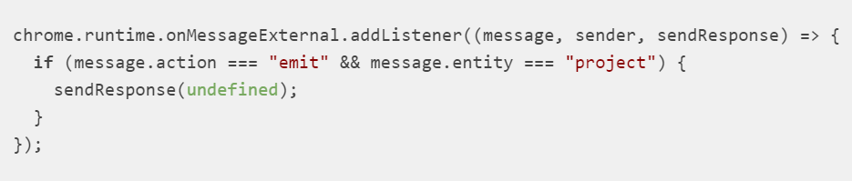

### AutoTCG专业版常见问题

#### 如何记录悬停
>鼠标悬停（aka悬停）操作很难作为记录周期的一部分自动捕获.  
>要将悬停添加到您的测试中，需要进行一些手动干预。您可以通过两种不同的方式来做到这一点  
>##### 1.在录制时添加
>+ 录制时，右键单击要悬停的元素
>+ 在出现的菜单中，单击Selenium IDE，然后Mouse Over
>+ 确认Mouse Over测试步骤在测试中的正确位置(并根据需要将其拖放到其他位置)  
>##### 2.在测试编辑器中手动添加
>+ 右键单击IDE中的测试步骤
>+ 选择 Insert new command
>+ 输入mouse over到Command输入字段
>+ 在Target输入字段中输入要悬停的定位器（或单击Select target in page并选择要悬停的元素）
#### 为什么在日期输入框中键入的数字不能正确显示
> 通过Selenium IDE的命令行运行程序运行测试时，会出现此问题.  
> 要绕开它，您将需要启用w3c模式，您可以通过-c "chromeOptions.w3c=true"在启动运行程序时通过来进行此操作.  
> 启用w3c模式会影响Selenium Actions的性能（如果您的测试最终使用它们）是毫无意义的，因此仅当日期输入字段存在问题时才使用此模式。
#### 如何让IDE等待特定条件成立才能继续进行？
> 在某些情况下，IDE中的内置等待策略还不够。发生这种情况时，可以使用可用的显式等待命令之一.  
>+ wait for element editable
>+ wait for element present
>+ wait for element visible
>+ wait for element not editable
>+ wait for element not present
>+ wait for element not visible

#### 如何在文本验证中使用正则表达式
> 这是我们最终将要添加的功能。解决方法是，可以将XPath定位器与starts-with和contains关键字一起使用. 

>| 命令    |  目标  |  
>|  ----  | ----  |
>| assertElementPresent  | //a@[starts-with(.,'you are the'）and contains（。，'今天要登录的用户'）] |  
#### 如何滚动
> Selenium IDE中没有用于滚动的独特命令，因为Selenium中没有实现任何命令。取而代之的是，您可以使用scrollToJavaScript中的命令通过指定x和y协调要滚动到的位置来完成此任务.  
>| 命令    |  目标  |  
>|  ----   | ----   |
>|executeScript|window.scrollTo（0,1000） |
#### 保存文件
>##### 为什么我保存SIDE项目的位置不记得了？
>##### 为什么每次要保存项目时都需要逐步执行“另存为”流程？
>##### 为什么需要覆盖以前保存的文件？
> 所有这些问题都是同一个问题的一部分-由于浏览器扩展Selenium IDE不能访问文件系统。提供“保存”功能的唯一方法是通过下载文件。当IDE移至本机应用程序时，将解决此问题。这将使IDE具有首要的文件系统访问权限，从而使它能够提供优美的“保存”体验.  
#### 如何在严格的代理/防火墙后面安装IDE
>在某些情况下，您可能没有完全的公共Internet访问权限（例如，在“公司代理或防火墙”之后）。在这些环境中，您将需要获取内置的Selenium IDE ZIP文件的副本，以便记录自动测试脚本。可以在GitHub的“发布”部分中找到：https://github.com/SeleniumHQ/selenium-ide/releases并非所有版本都包含“ selenium-ide.zip”，因为其中一些仅仅是“源代码”版本。查找具有此zip文件的最新版本。这意味着它是提交给Chrome和Firefox商店的最新版本  
> ##### 正式签署的版本:
>从项目发行页面下载zip文件可为您提供未签名的ZIP文件。您也可以从以下位置获取经过正式签名的安装程序，这些安装程序在“受保护的环境”中可以更好地发挥作用  
>+ [ Firefox附加组件 ](https://addons.mozilla.org/en-US/firefox/addon/selenium-ide/)
>+ [所需的“ .xpi”安装程序的下载说明](https://superuser.com/questions/646856/how-to-save-firefox-addons-for-offline-installation) 
>+ ***注意：如果您已经安装了插件（例如，在便携式计算机上尝试获取安装程序的副本），则在尝试访问插件时只会看到“删除”按钮。因此，将它们删除一次，让安装程序移至另一台未连接的计算机，然后根据需要在主设备的浏览器中重新安装***
>+ [Chrome商店](https://chrome.google.com/webstore/detail/selenium-ide/mooikfkahbdckldjjndioackbalphokd)
>+ [所需的“ .crx”安装程序的下载说明](https://stackoverflow.com/questions/25480912/how-to-download-a-chrome-extension-without-installing-it)
>+ ***注意：您不能直接从Chrome商店中获取“ .crx”文件。相反，您需要在本地安装一次，然后转到计算机上的安装目录以进行检索***
#### 附加插件后，为什么没有保存对话框出现
> 由于当前的Chrome错误，如果您不答复Selenium IDE发出的消息，则不会进行进一步处理。为了解决此问题，请确保侦听emit该实体的操作project并使用进行回复undefined  
  

